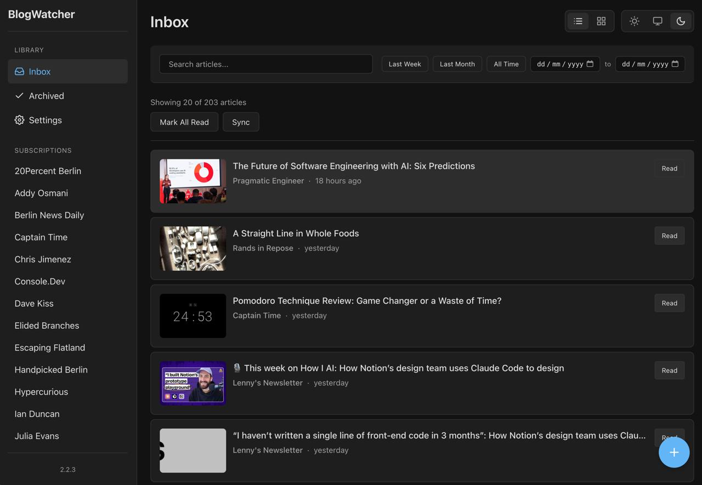
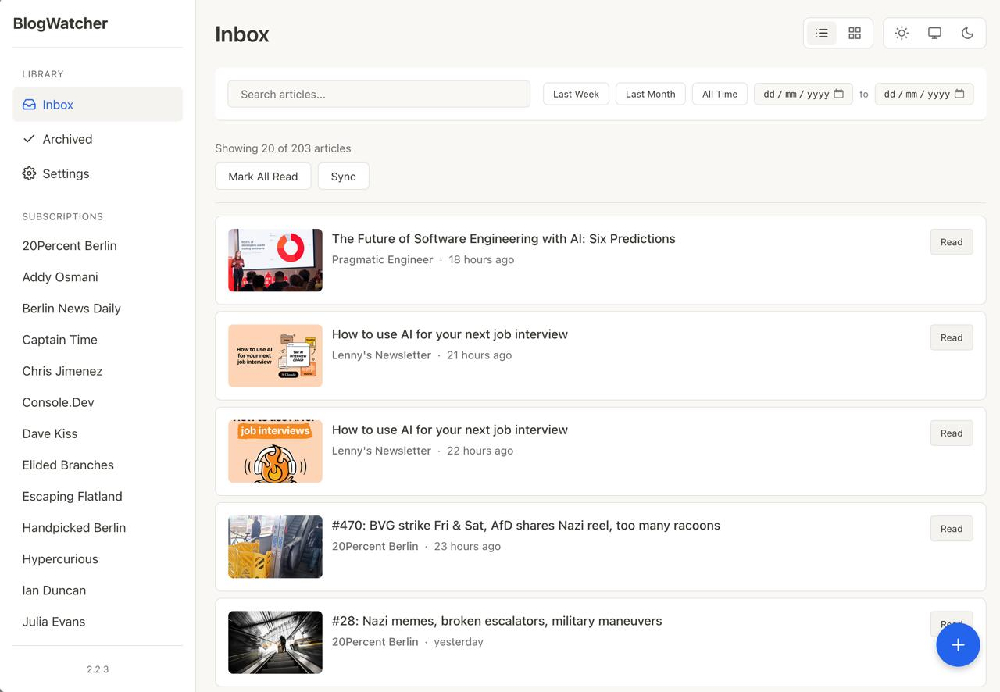

# BlogWatcher UI

A modern web UI for [BlogWatcher](https://github.com/Hyaxia/blogwatcher), a Go CLI tool for tracking blog articles and managing read/unread status. This web interface provides an intuitive way to browse, search, and manage articles from your tracked blogs.

## Features

- **Modern Web Interface** - Clean, responsive UI built with Go templates and HTMX
- **Real-time Updates** - HTMX-powered partial page updates for seamless interactions
- **Article Management** - Mark articles as read/unread with a single click
- **Advanced Filtering** - Filter by read/unread status, blog, date range, and search query
- **Blog Management** - View all tracked blogs with sync status
- **Automatic Sync** - Trigger scans to discover new articles from all blogs
- **Thumbnail Support** - Visual previews of articles with Open Graph image extraction
- **Search** - Full-text search across article titles, date posted, etc.

 

## Prerequisites

- Go 1.25.6 or later
- BlogWatcher CLI tool installed and configured (see [BlogWatcher](https://github.com/Hyaxia/blogwatcher) for installation)
- SQLite database at `~/.blogwatcher/blogwatcher.db` (created by BlogWatcher CLI)

## Installation

### Install with go install

```bash
# Install the latest version (recommended)
go install github.com/esttorhe/blogwatcher-ui/cmd/server@v1.0.1

# Or install from latest tag
go install github.com/esttorhe/blogwatcher-ui/cmd/server@latest

# If you get module cache issues, clear it first:
go clean -modcache
go install github.com/esttorhe/blogwatcher-ui/cmd/server@v1.0.1

# Run the installed binary
server
```

**Note:** If you encounter checksum verification errors (404 from sum.golang.org), the repository may be private. Set these environment variables:
```bash
export GOPRIVATE=github.com/esttorhe/blogwatcher-ui
export GONOPROXY=github.com/esttorhe/blogwatcher-ui
export GONOSUMDB=github.com/esttorhe/blogwatcher-ui
```

The binary will be installed to `$GOPATH/bin` (or `$GOBIN` if set). Make sure this directory is in your `PATH`.

### Build from Source

```bash
# Clone the repository
git clone https://github.com/esttorhe/blogwatcher-ui.git
cd blogwatcher-ui

# Build the server
go build ./cmd/server

# Run the server
./server
```

The server will start on `http://localhost:8080` by default.

### Development

```bash
# Run with hot reload (requires air or similar tool)
air

# Or run directly
go run ./cmd/server
```

## Usage

1. **Start the Server**
   ```bash
   ./server
   ```

2. **Open in Browser**
   Navigate to `http://localhost:8080`

3. **Sync Articles**
   - Click the "Sync" button to scan all tracked blogs for new articles
   - The article list will automatically refresh with new content

4. **Browse Articles**
   - View unread articles by default
   - Filter by read/unread status using the filter buttons
   - Filter by specific blog using the sidebar
   - Search articles using the search bar
   - Filter by date range using the date pickers

5. **Manage Articles**
   - Click an article card to mark it as read
   - Use "Mark All Read" to mark all unread articles as read
   - Filter by blog to mark all read for a specific blog

## Architecture

This project was built using [Claude Code](https://claude.ai/code) with the [get-shit-done](https://github.com/glittercowboy/get-shit-done) framework, following spec-driven development principles.

### Project Structure

```
blogwatcher-ui/
├── cmd/
│   └── server/
│       └── main.go          # Server entry point
├── internal/
│   ├── model/               # Data models
│   ├── storage/              # Database layer
│   ├── server/              # HTTP server and handlers
│   ├── scanner/              # Blog scanning logic
│   ├── scraper/             # HTML scraping
│   ├── rss/                 # RSS/Atom feed parsing
│   └── thumbnail/           # Thumbnail extraction
├── templates/               # Go HTML templates
│   ├── base.gohtml
│   ├── pages/
│   └── partials/
├── static/                  # Static assets (CSS, JS)
└── go.mod
```

### Key Technologies

- **Go 1.25.6** - Backend server
- **HTMX** - Progressive enhancement for dynamic interactions
- **SQLite** - Database (shared with BlogWatcher CLI)
- **Go Templates** - Server-side rendering
- **goquery** - HTML parsing and scraping
- **gofeed** - RSS/Atom feed parsing

## API Endpoints

- `GET /` - Main index page
- `GET /articles` - Article list (supports HTMX partial updates)
- `GET /blogs` - Blog list (supports HTMX partial updates)
- `POST /articles/{id}/read` - Mark article as read
- `POST /articles/{id}/unread` - Mark article as unread
- `POST /articles/mark-all-read` - Mark all unread articles as read
- `POST /sync` - Trigger blog scan and refresh article list

### Query Parameters

- `filter` - Filter by status: `read`, `unread` (default)
- `blog` - Filter by blog ID
- `search` - Full-text search query
- `date_from` - Filter articles from date (YYYY-MM-DD)
- `date_to` - Filter articles to date (YYYY-MM-DD)

## Database

The UI uses the same SQLite database as the BlogWatcher CLI tool, located at:
```
~/.blogwatcher/blogwatcher.db
```

The database schema includes:
- `blogs` - Tracked blogs (name, URL, feed URL, scrape selector)
- `articles` - Discovered articles (title, URL, dates, read status, thumbnails)

## Development

### Requirements

- Go 1.25.6+
- BlogWatcher CLI configured with at least one blog

### Running Tests

```bash
go test ./...
```

### Building

```bash
# Build binary
go build -o blogwatcher-ui ./cmd/server

# Build for specific platform
GOOS=linux GOARCH=amd64 go build -o blogwatcher-ui-linux ./cmd/server
```

## Contributing

Contributions are welcome! Please feel free to submit a Pull Request.

## License

MIT License - see LICENSE file for details

## Acknowledgments

- Built with [Claude Code](https://claude.ai/code)
- Developed using [get-shit-done](https://github.com/glittercowboy/get-shit-done) framework
- UI for [BlogWatcher](https://github.com/Hyaxia/blogwatcher) by [Hyaxia](https://github.com/Hyaxia)
